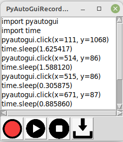

# PyAutoGUI-Recorder
## Abstract
A recorder of mouse clicks to generate PyAutoGUI code with a GUI
## Description


PyAutoGUI-Recorder records mouse clicks on the desktop and allows to write Python code to a file based on the pyautogui module. PyAutoGUI-Recorder also captures the delays between mouse clicks and generates the corresponding time.sleep statements in the Python code.


Use the Recording button to start recording


Use the Stop button to stop recording


Use the Play button to replay previously recorded mouse clicks.


Use the Download button to save Python code to a file

## Synopsis
```
Usage: 
python3 PyAutoGuiRecorder.oy OPTIONS


Options:
  -h, --help     show this help message and exit
  --delay=DELAY  Replay delay in seconds
  --recordMoves  Capture simply mouse moves

```

- Option --delay can be used to specify a fixed delay between mouse clicks
- Option --recordMoves can be used to in addition to mouse clicks periodically also capture mouse moves
